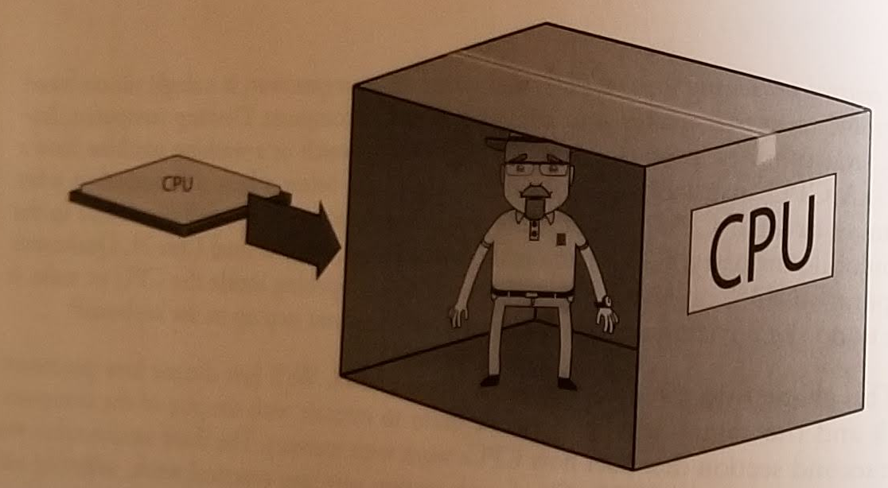
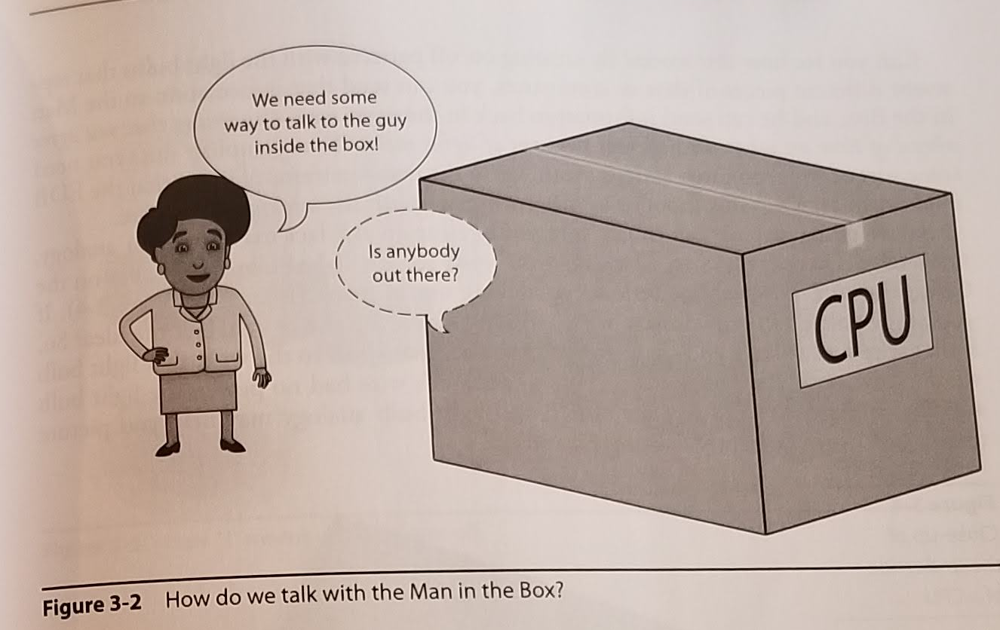
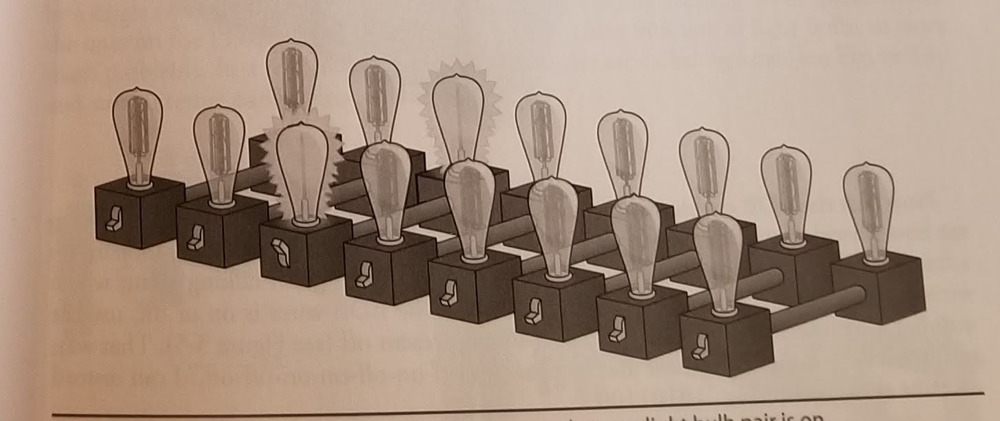
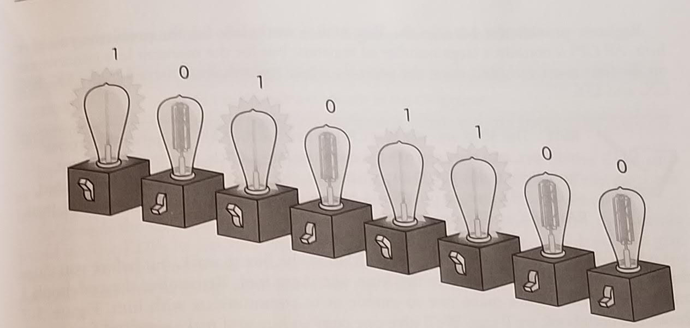
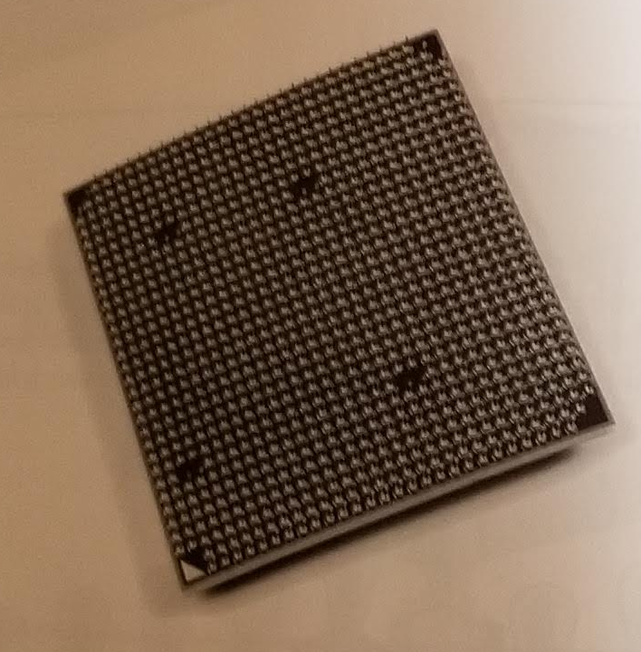
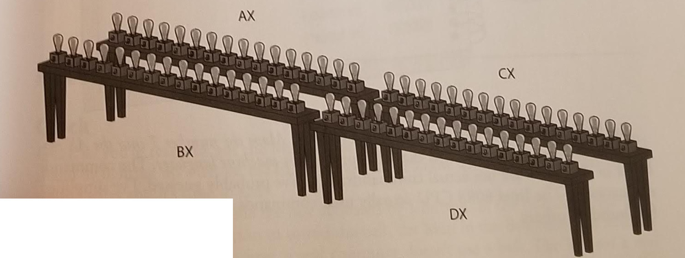
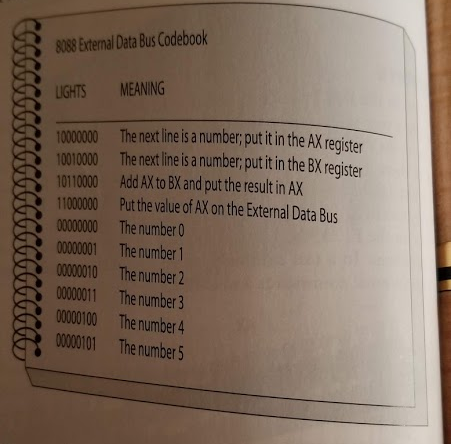
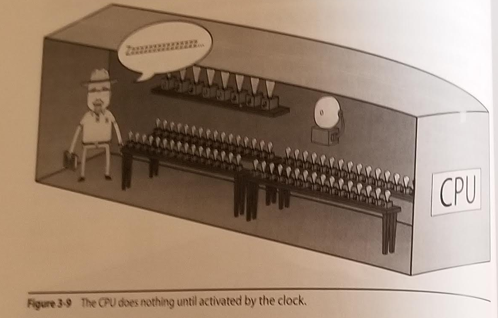
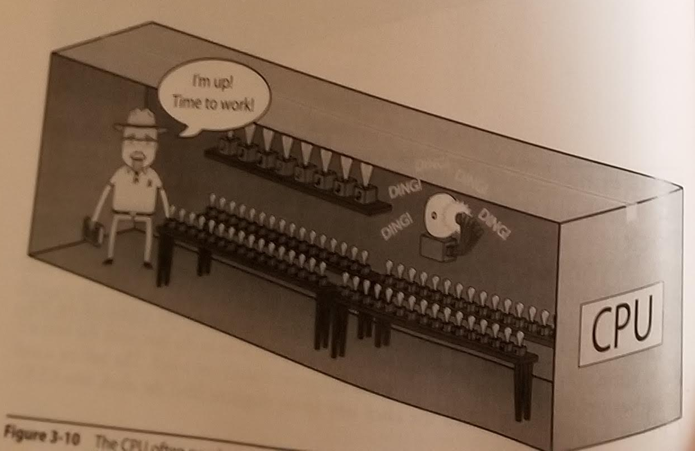
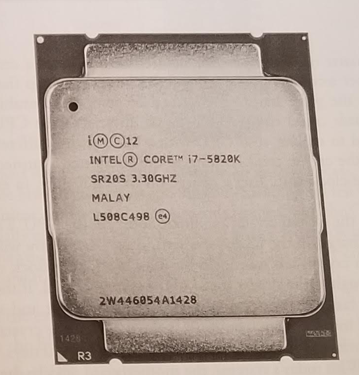

# Chapter 3 - CPUs

## What is a CPU?

* Man in the Box Analogy
    * There's a man in the box who is very good at math.
    * But he's stuck in the box.
        
    * We need to come up with some way of communicating with him.
        
    * Imagine we have 16 light bulbs in 8 pairs.
        
    * External Data Bus (EDB)
    * You can send information to the man and get it back
        * *As long as you agree beforehand on what each pattern of lights means*
    * So we will need to construct some kind of code book. Keep this in mind.
    * Next, we need a naming convention. On-Off doesn't work
        * How about 1 and 0?
            
    * Remember, this is just a metaphor:
        
    * Registers:
        
    * Next we need the code book:

        

        | Lights   | Meaning                                                                 |
        |:---------|:------------------------------------------------------------------------|
        | 10111010 | The next line of code is a number, Put that number into the DX Register |
        | 01000001 | Add 1 to the number already in the CX Register                          |
        | 00111100 | Compare the value in the AX register with the next line of code         | 

    * We put *lines of code* on the EDB and we can tell the Man to do things. 
    * All of the machine language commands that the CPU understands are called the *instruction set*
    * Finally, we are ready to work - But wait. What are we missing?
* The Clock
    * There's a wire called the *clock wire*
        
    * When there's a signal, it means that there's data waiting to be processed.
        
    * *Clock speed* is the number of commands a CPU can complete in a given time.
    * The 8088 had a clock speed of 4.77 MHz (4.77 million cycles per second)
        * 1 herz (1Hz) = 1 cycle per second
        * 1 megahertz (1 MHz) = 1 million cycles per second
        * 1 gigahertz (1 GHz) = 1 billion cycles per second
    * The clock speed is only the *maximum* speed. It doesn't always run full bore.
        
    * The *System Crystal* determines the speed of the CPU. It's a quartz oscillator soldered into the motherboard.
    * {: .label .label-yellow}Note: 
        * CPUs with the same architecture are often marketed with different speeds. Why?
    * Image of crystal in the textbook.
* EDB
    * Example program
* Memory
    * What is memory?
    * What is its purpose?
    * Why can't we just use the hard drive?
    * Example program
    * Random Access Memory (Chapter 4)
        * Think of it like a spreadsheet
        * Each cell can store a bit
        * Each row is 8 bits across (to match the bus in the 8088)
        * 4 bits = nibble
        * 8 bits = a bytes
        * 16 bits = a word
        * 32 bits = a double word
        * 64 bits = a paragraph or quad word
    * Why is it Random Access?
        * It can access any line of data as fast as any other line of data
    * We use DRAM (*Dynamic RAM*)
        * It needs a constant electrical charge and a periodic refresh of the circuits or it loses all data.
        * The refresh takes time away from processing, however.
        * This is not permanent storage.
* Address Bus
    * How do the CPU and the RAM talk to each other?
    * The EDB extends from the CPU to the RAM.
    * How does this work to access any memory on the RAM chip?
    * Something like a *memory controller chip*.
    * Address Bus is another set of wires connected to the MCC.
        * The 8088 had 20 wires in the address bus.
        * How many locations can this address?
        * How do you decide which numbers address which locations in RAM?
        * Address space of the 8088 is 1,048,576
        * There's another word for this number. Megabyte
        * This was way more than it needed. Maybe they only had a few thousand actual memory locations.
    * 
