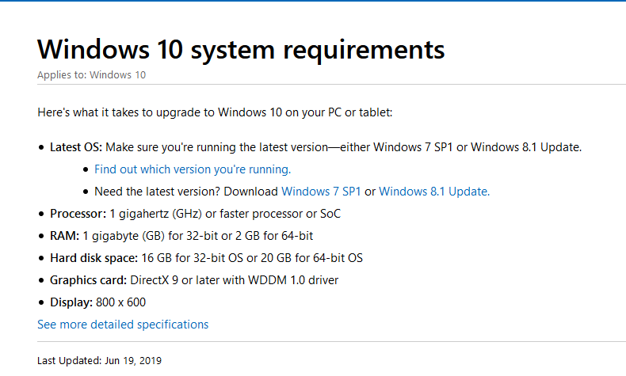

Chapter 4 - RAM
===============

* Questions
    1. "How much RAM is in your computer?"
    1. "What is RAM and why is it so important that every PC has enough?"
* What is RAM?
* Programs and data are stored on a mass storage device until they are needed.
* When you load it, the PC copies the program from storage to main memory. RAM
* Computers use *dynamic random access memory* (DRAM)
* There has been an evolution of RAM
    * SDRAM
    * RDRAM
    * DDR RAM
* We'll start with DRAM

## Historical Conceptual

### Understanding

* Recall, thinking of DRAM like a spreadsheet.
* Each cell is a type of semiconductor that can hold a charge, a single bit.
* It uses microscopic capacitors and transistors.
* These are arranged in a rectangular pattern on the chip.
* Each chip has i rows, and j columns. In this case, i is the amount of RAM, j is the width of the RAM

### Organizing

* DRAM dates back to the 1970s.
* Most computers have some kind of DRAM.
* 8088 had an 8-bit frontsize bus. So all commands were in 8-bit chunks
* The chips were all 1-bit wide. So you just used to 8 of them to make an 8-bit addressable memory module.

### Practical DRAM

* Refer to text - Additional background  (8088 vs 8086)

### DRAM Sticks

* Data bus gets bigger, so does the need for RAM wide enough to fill the bus.
* 80386 had a 32-bit data bus. So it needed 32-bit wide DRAM
* And they did use the 1-bit wide chips to put data on this bus!
* So DRAM chips got smaller, and had wider buses.
* Image in book: *single inline memory module* (SIMM)
    * 8 DRAM chips on it.
* To get the right chips, you need to look at the your motherboard and CPU to ensure that it's compatible.
* Now, we have x32 and x64 memory.

### Consumer RAM (Caveat)

* By convention, we usually talk about total memory capacity rather than number of rows and bit width.
* But, 1 8-GB chip is different from 2 4-GB chips.
* Regardless, however, more RAM is always better.

## Types of RAM

### SDRAM

* *synchronous DRAM*
* SDRAM is still DRAM, but it is tied to the system clock.
* Cam out in 1996 on the first *dual inline memory module (DIMM)*
* Pin counts are not necessarily needed, but they are in the book.
* No matter how many pins, they still have 64-bit-wide data to match every CPU since the Pentium
* Types:
    * 168-pin standard fro desktop
    * *micro-DIMM*
    * *small-outline DIMM* (SO-DIMM)
* Clock speeds of frontsize bus in early SDRAM systems: 66, 75, 83, 100, 133 MHz.
* RAM Speed has to meet or exceed the system speed, or it would be unstable.
* In those days, they used terms PC100, PC133 to designate clock speed of RAM.

### RDRAM

* Rambus DRAM
* It was a short-lived technology.
* Supported speeds up to 800 MHz
* Made for the Pentium 4
* RIMMs were the packages.
* Expensive and short-lived.

## DDR SDRAM

* {: .label .label-yellow}This is on the test
* The alternative to RDRAM: *Double Data Rate SDRAM*
* They copied Rambus, making two processes for every clock cycle.
* AMD at the time was using a double clocked frontside-bus, so this worked nicely.
* This won because, while it was slower than RDRAM, it was way cheaper, and relatively low frontside bus speeds made it a moot point.
* DDR1 had 184-pin and 168-pin DIMMs, but were notched differently.
    * Laptop SO-DIMMS were 200- and 172-pin.
* Naming convention is based on bytes of throughput:
    * multiply SDRAM speed by 8 (bytes) and you get the PC-speed
    * Double the clock speed to get the DDR speed rating

| Clock Speed | DDR Rating | PC SPeed Rating |
| =========== | ========== | =============== |
| 100 MHz     | DDR-200    | PC-1600         |
| 133 MHz     | DDR-266    | PC-2100         |

etc...

* By 2003, Intel just accepted that DDR won.
* From Rambus was the *dual-channel architecture*. Use two sticks of RAM to increase throughput.
* Dual channel RAM chips are just DDR chips, but they are sold in matched pairs and marketed as dual channel.
* Dual-channel *does* often require two identical sticks of DDR, and they have to be snapped into paired slots.
* Pay attention to color of the slots

## DDR23

* DDR2 is just DDR with some incremental improvements
* Runs faster, uses less power
* It has a faster input/output circuit (not necessarily faster RAM chips)
* It has a "cache"-like buffer to store information
* Speed ratings are further augmented by a DDR2 rating.

## DDR3

* DDR3 is higher speeds, more efficient architecture, 30 percent less power consumption than DDR2.
* Same pinout as DD2, but different slots
* DDR3 doubles the DDR2 buffer from 4 bits to 8.
* Some DDR3 modules have XMP (Extreme Memory Profile) which allows for easy overclocking.
* Higher density chips. Up to 16-GB per module.
* AMD's version of XMP is called AMP (AMD Memory Profile)
* Be wary of the warning in the text about memorizing the pin counts...
* Some DD3 mobos support *triple-channel* and *quad-channel*. This uses 3 or 4 sticks of RAM instead of two.
* Largely, both AMD and Intel have switched back to dual, but there are still some systems.
* The buffer size is responsible for the doubled clock speed because it enables it to transmit twice as much data every cycle.
* See the table.

## DDR3L/DDR3U

* DDR34L is low-voltage version.
* Less electricity. Less heat.
* Primarily used in server farms.
* Not on the exam
* 1.35 V vs 1.5 V

## DDR4

* 2014.
* Higher density. Lower voltages.
* Faster data transfer
* Theoretical DIMMs up to 512 GB
* Typically top out at 64GB per DIMM
* Run at only 1.2 V
    * Even lower-voltage versions, too!
* 288-pin DIMM, not backward compatible with DDR3 slots.
* Typically use different terminology now:
    * megatransfers per second (MT/s)
* Chart in book
* Mention what is actually on the exam.
* My office computer CPU-Z output:

## Double-Sided DIMMs

* Big thing here is to pay attention to documentation and compatibility

## Latency

* column array strobe latency. (CAS)
* All other things being equal, a lower delay means faster ram. CL17 is faster than CL19
* Number refers to number of clock cycles for RAM to access memory location.
* Latency is tied to clock (since it's measured in ticks). High latency doesn't necessarily mean slow RAM if the clock speed is high enough.
* Compatibility: Get the quickest RAM your system can handle.

## Parity and ECC

* Occasionally, there are mistakes. Strange quantum effects. Electrical hiccups. Whatever they are, sometimes bits are flipped.
* Most of the time, you never even notice it.
* But there are systems that *need* flawless execution.
* Fault-resistant RAM
    * Parity RAM
        * Has an extra bit that could tell you if there was an error. (even or odd)
        * Only option for some time
        * Could not correct errors
        * Sometimes it had false positives or false negatives.
    * ECC (Error Correction Code)
        * Can detect and correct any single-bit error.
        * Can detect but not correct 2+ bit errors.
        * ECC RAM is slower than non-ECC RAM.

## Registered and Buffered Memory

* Sometimes, RAM will have a little buffer or register on the RAM chips which can speed things up by giving the RAM a staging ground for dtata find bid.
* Just remember, that some systems require buffered and other systems require unbufferred. Few can accommodate both.

## Do you need RAM?

* Single best thing you can do to increase system performance.
* Two things indicate more RAM needed
    * Excessive sluggish performance
    * Excessive HDD accessing.
* It's the easiest thing to upgrade and can breathe new life into an older system.

### Virtual Memory

* Solution to problem of finite RAM
* Use the HDD/SSD to supplement RAM
* Called a *page file* or a *swap file*
* What's Virtual memory for?
* Windows recommends 1.5x the installed RAM.
* Follow example in the text.
* All of this is automatic and completely transparent to the user.
* What happens when you click on an app that has been written out to Virtual Memory?
* These processes do take time however.
* It slows the machine down.
* New apps load slower
* If windows accesses page file too frequently, you have *thrashing*
    * Using the page file is not the problem (it happens all the time)
    * Excessively using it is the problem.

## RAM Recommendations

* More reasonable:
    * 32-bit Windows 2GB to get by, 4 GB is better
    * 64-bit Windows 4 to get by, 8 for better, 16+ for serioues intensive work (video editing or whater)
* macOS likes at least 2 GB of RAM, but 8+ or more is always better
* Text has a warning about sealed systems
* Linux is a different story. Depends on Distro. Ubuntu is comparable to Windows/macOS

### How much RAM do I have?

* Windows-Pause, Super-pause
* Ctrl-Shift-Esc
* Mention Ready-Boost

### Getting the right RAM

